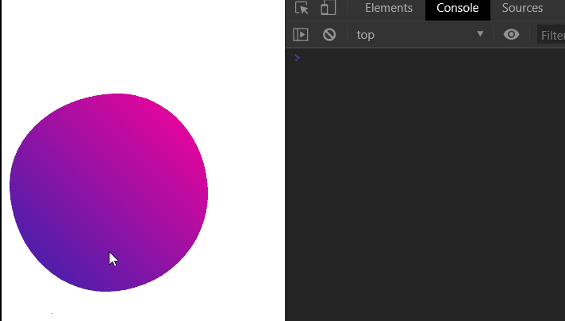

# 前端-WebWorker总结

  - [js为什么是单线程？](#js%E4%B8%BA%E4%BB%80%E4%B9%88%E6%98%AF%E5%8D%95%E7%BA%BF%E7%A8%8B)
  - [浏览器是多线程的](#%E6%B5%8F%E8%A7%88%E5%99%A8%E6%98%AF%E5%A4%9A%E7%BA%BF%E7%A8%8B%E7%9A%84)
  - [利用Web Worker开启一个子线程](#%E5%88%A9%E7%94%A8web-worker%E5%BC%80%E5%90%AF%E4%B8%80%E4%B8%AA%E5%AD%90%E7%BA%BF%E7%A8%8B)
  - [兼容性](#%E5%85%BC%E5%AE%B9%E6%80%A7)
  - [总结](#%E6%80%BB%E7%BB%93)
  - [🙏 感谢](#-%E6%84%9F%E8%B0%A2)

## js为什么是单线程？
主要是因为最开始`javascript`是单纯的服务于浏览器的一种脚步语言（那时候没有`nodejs`）。浏览器是为了渲染网页，通过`dom`与用户交互，如果一个线程需要给`dom`执行`click`事件，而另一个进程要删除这个`dom`，这2个动作可能同时进行，也可能先后进行（像`java, c#`等语言中会引入锁的概念，这样会变得异常复杂），那么就会造成很多不可预料的错误。

> 所以，为了避免复杂性，从一诞生，`JavaScript`就是单线程，这已经成了这门语言的核心特征。为了利用多核CPU的计算能力，`HTML5`提出**Web Worker**标准，允许`JavaScript`脚本创建多个线程，但是子线程完全受主线程控制，且不得操作`DOM`。所以，这个新标准并没有改变`JavaScript`单线程的本质。


## 浏览器是多线程的
浏览器打开一个tab，就会单独开一个进程，这个进程包含多个线程，参考：[JS运行机制](https://segmentfault.com/a/1190000012925872)
主要包含的线程有：
1. GUI渲染线程

> 负责渲染浏览器界面，解析HTML，CSS，构建DOM树和RenderObject树，布局和绘制等。
> 当界面需要重绘（Repaint）或由于某种操作引发回流(reflow)时，该线程就会执行
> 注意，**GUI渲染线程与JS引擎线程是互斥的**，当JS引擎执行时GUI线程会被挂起（相当于被冻结了），GUI更新会被保存在一个队列中**等到JS引擎空闲时**立即被执行。

2. JS引擎线程

> 也称为JS内核，负责处理Javascript脚本程序。（例如V8引擎）
> JS引擎线程负责解析Javascript脚本，运行代码。
> JS引擎一直等待着任务队列中任务的到来，然后加以处理，一个Tab页（renderer进程）中无论什么时候都只有一个JS线程在运行JS程序
> 同样注意，**GUI渲染线程与JS引擎线程是互斥的**，所以如果JS执行的时间过长，这样就会造成页面的渲染不连贯，导致页面渲染加载阻塞。

3. 事件触发线程

> 归属于浏览器而不是JS引擎，用来控制事件循环（可以理解，JS引擎自己都忙不过来，需要浏览器另开线程协助）
> 当JS引擎执行代码块如setTimeOut时（也可来自浏览器内核的其他线程,如鼠标点击、AJAX异步请求等），会将对应任务添加到事件线程中
> 当对应的事件符合触发条件被触发时，该线程会把事件添加到待处理队列的队尾，等待JS引擎的处理
> 注意，由于JS的单线程关系，所以这些待处理队列中的事件都得排队等待JS引擎处理（当JS引擎空闲时才会去执行）

4. 定时触发器线程

> 传说中的`setInterval`与`setTimeout`所在线程
> 浏览器定时计数器并不是由JavaScript引擎计数的,（因为JavaScript引擎是单线程的, 如果处于阻塞线程状态就会影响记计时的准确）
> 因此通过单独线程来计时并触发定时（计时完毕后，添加到事件队列中，等待JS引擎空闲后执行）
> 注意，W3C在HTML标准中规定，规定要求setTimeout中低于4ms的时间间隔算为4ms。


5. 异步http请求线程

> 在`XMLHttpRequest`在连接后是通过浏览器新开一个线程请求
> 将检测到状态变更时，如果设置有回调函数，异步线程就**产生状态变更事件**，将这个回调再放入事件队列中。再由`JavaScript`引擎执行。

上面列出的线程之间，有一个重要的规则是：**GUI渲染线程与JS引擎线程互斥**，那么我们可以得出以下结论**JS阻塞页面加载**，那么在`js`运行的这段时间内，`GUI`的渲染会停止，这段时间内的界面交互，`DOM`的重绘与回流会停止，会被保存到待执行队列中，直到`js`线程空闲，才会执行这些队列。
我们用下面的一段代码和运行结果来说明这个机制：
```html
<html>
<head>
	<style>
		.box {
			width: 200px;
			height: 200px;
			margin-top: 100px;
			background: #f09;
			animation: bounce 2s linear 0s infinite alternate;
			background-image: linear-gradient(45deg, #3023AE 0%, #f09 100%);
		}
		@keyframes bounce {
			0% {
				border-radius: 40% 60% 72% 28% / 70% 77% 23% 30%;
			}
			100% {
				border-radius: 75% 25% 24% 76% / 13% 15% 85% 87%;
			}
		}
	</style>
</head>
<body>
	<div class="box"></div>
</body>
<script>
	// 计算斐波那契数列,这个数列从第3项开始，每一项都等于前两项之和。
	function recurFib(n) {
		if (n < 2) {
			return n;
		} else {
			return recurFib(n - 1) + recurFib(n - 2)
		}
	}

	window.onload = function () {
		setTimeout(function () {
			console.time("运算耗时：")
			// 计算n为40的结果
			console.log('结果：', recurFib(40))
			console.timeEnd("运算耗时：")
		}, 2000)
		document.getElementsByClassName("box")[0].addEventListener('click', function () {
			console.log('click')
		})
	}
</script>
</html>
```

可以看到，一开始网页和动画正常运行，但是开始执行计算斐波那契数列后，动画就停止了，页面也停止响应鼠标的`click`事件了，直到`recurFib(40)`计算出结果后，动画才开始继续执行，而期间积攒的`click`事件也在一起被执行。这就解释了**GUI渲染线程与JS引擎线程互斥**。由于这个弊端`HTML5`提出**Web Worker**标准。

## 利用Web Worker开启一个子线程
Web Worker 有以下几个使用注意点。
> 1.同源限制
分配给 Worker 线程运行的脚本文件，必须与主线程的脚本文件同源。
2.DOM 限制
Worker 线程所在的全局对象，与主线程不一样，无法读取主线程所在网页的 DOM 对象，也无法使用`document`、`window`、`parent`这些对象。但是，Worker 线程可以`navigator`对象和`location`对象。
3.通信联系
Worker 线程和主线程不在同一个上下文环境，它们不能直接通信，必须通过消息完成。
4.脚本限制
Worker 线程不能执行`alert()`方法和`confirm()`方法，但可以使用 XMLHttpRequest 对象发出 AJAX 请求。
5.文件限制
Worker 线程无法读取本地文件，即不能打开本机的文件系统（`file:`），它所加载的脚本，必须来自网络。

以上规则引用阮一峰老师的： [Web Worker 使用教程](http://www.ruanyifeng.com/blog/2018/07/web-worker.html)
创建Worker时，JS引擎向浏览器申请开一个子线程（子线程是浏览器开的，完全受主线程控制，而且不能操作DOM）
JS引擎线程与worker线程间通过特定的方式通信（`postMessage API`，需要通过序列化对象来与线程交互特定的数据）。
下面我们用`worker`的相关`api`来解决上面卡顿的问题。
```html
<!--index.html主线程-->
<html>
<head>
	<style>
		.box {
			width: 200px;
			height: 200px;
			margin-top: 100px;
			background: #f09;
			animation: bounce 2s linear 0s infinite alternate;
			background-image: linear-gradient(45deg, #3023AE 0%, #f09 100%);
		}
		@keyframes bounce {
			0% {
				border-radius: 40% 60% 72% 28% / 70% 77% 23% 30%;
			}
			100% {
				border-radius: 75% 25% 24% 76% / 13% 15% 85% 87%;
			}
		}
	</style>
</head>
<body>
	<div class="box"></div>
</body>
<script>
	window.onload = function () {
		// 创建一个子线程worker实例
		var worker = new Worker('./test.js');
		setTimeout(function () {
			// 通信：向子线程发送消息
			worker.postMessage('start')
		}, 2000)
		worker.addEventListener('message', function(res) {
			//  通信：收到子线程消息
			console.log('result:',JSON.stringify(res.data));
			// 关闭worker线程
			worker.terminate();
		})
		document.getElementsByClassName("box")[0].addEventListener('click', function () {
			console.log('click')
		})
	}
</script>
</html>
```
```javascript
// test.js子线程代码
// 通过监听message来接受主线程中的消息
addEventListener('message', function(res) {
    // 子线程向主线程中发生消息
    // 计算斐波那契数列,这个数列从第3项开始，每一项都等于前两项之和。
	if(res.data === 'start') {
		// 开始运算
		console.log('收到主线程消息，开始运算')
		function recurFib(n) {
			if(n < 2){
				// 主动关闭子线程
				// this.close()
				return n ;
			}else {
				return recurFib(n-1)+recurFib(n-2)
			}
		}
		console.time("运算时间：")
		// 计算n为40的结果
		var count = recurFib(40)
		console.timeEnd("运算时间：")
		// 向主线程发送消息
		console.log('运算完毕,发送消息给主线程！')
		this.postMessage(count);
	}
})
```
运行结果：



可以看到整个运行过程动画没有卡顿，也能响应`click`事件，所以在我们遇到大型计算的时候，请单独开启一个`worker`子线程来解决`js`线程阻塞`GUI`线程的问题。上文中只涉及到一部分`worker API`。关于`worker`更详细更具体的用法可以参见:  [Web Worker 使用教程](http://www.ruanyifeng.com/blog/2018/07/web-worker.html)

## 兼容性

可以看到除了Opera Mini浏览器，连IE都能使用了，所以兼容性问题不大。

## 总结
1.  由于`javaScript`的最初设计特点，采用了单线程的运行机制。
2.  浏览器是多个线程相互协作来工作的，但是**GUI渲染线程与JS引擎线程互斥**。
3.  `js`线程在运行时，会锁死`GUI`渲染线程，为了利用多核CPU的计算能力，`HTML5`提出**Web Worker**标准。
4.  `Web Worker`的使用有一些限制，比如说：同源限制，`DOM`限制，文件限制等，但能解决在`js`需要大量计算工作时，页面卡顿的问题。
5. `Web Worker`实际上是`js`线程的一个子线程，理论上`js`还是单线程的。

## 🙏 感谢
[知道 html5 Web Worker 标准吗？能实现 JavaScript 的多线程？](https://hacpai.com/article/1589852639518)